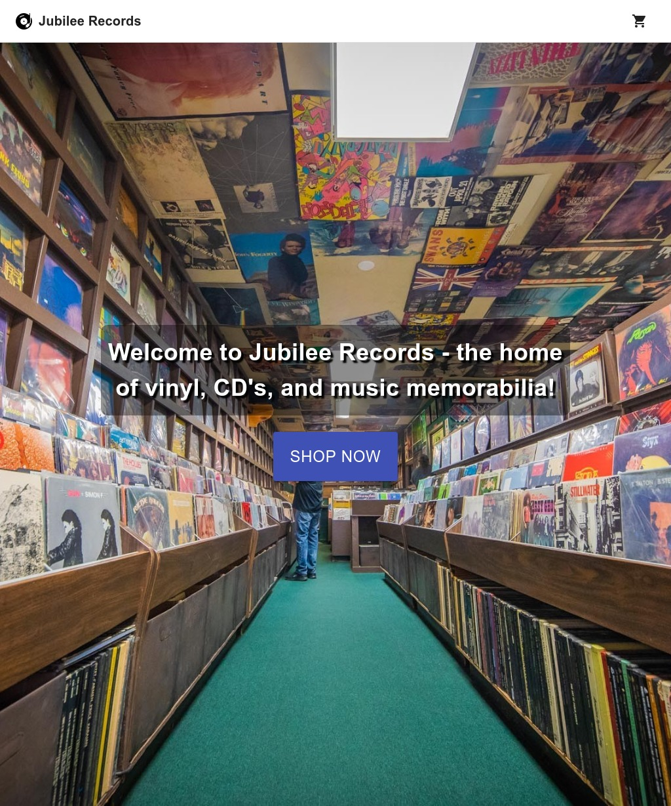

# Jubilee Records

A fully functioning e-commerce platform for a mock record store called Jubilee Records.

## Background

I built this project to teach myself about how an e-commerce platform works, further my skillset in React, and learn how to interact with a separate platform's backend in order to display and update data.

## Technologies

This project was created with:

- React
- Material UI
- Commerce.js
- Stripe

## Notes

While the API used for the backend is a closed/test API, it is advised you **do not** attempt to complete a purchase using an actual credit card. You can complete a demo purchase to check functionality by using the Stripe testing card found [here](https://stripe.com/docs/testing)

## Credits/Acknowledgements

This project was inspired by and built with the help of a tutorial by [Javascript Mastery](https://www.youtube.com/watch?v=377AQ0y6LPA)
